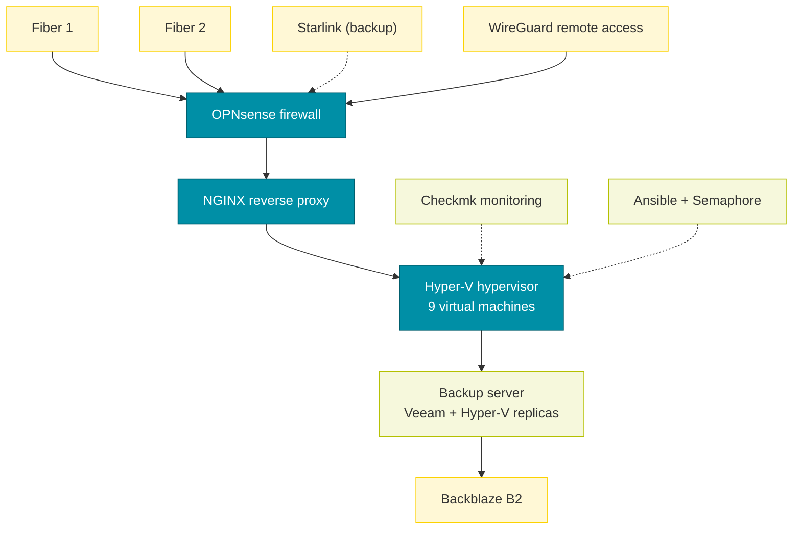
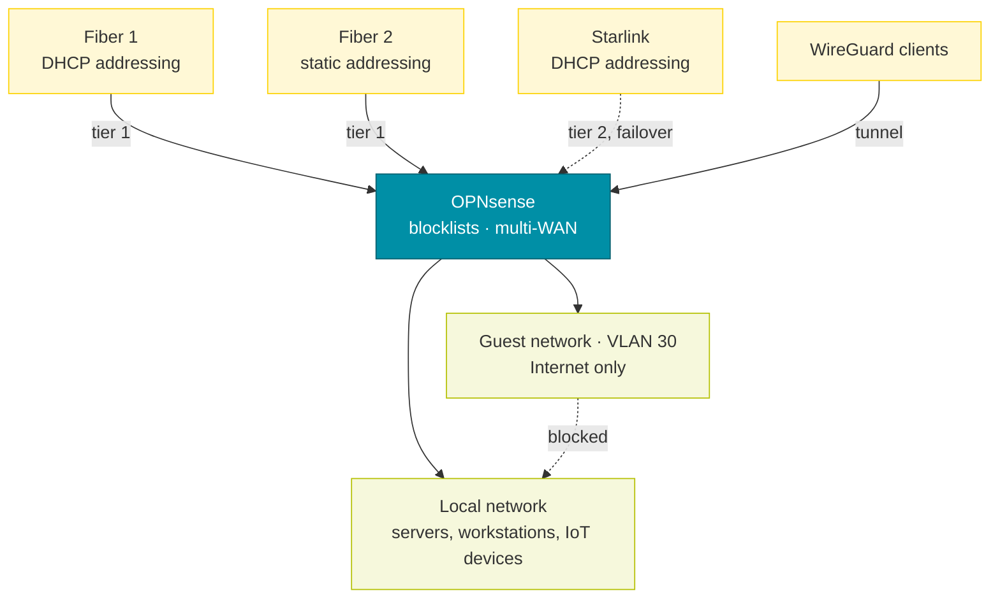
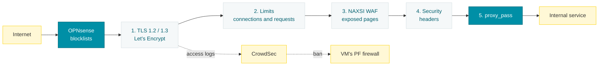
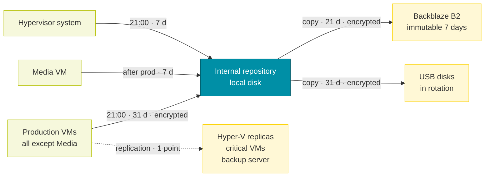
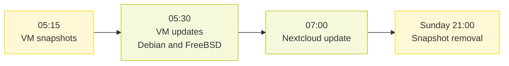
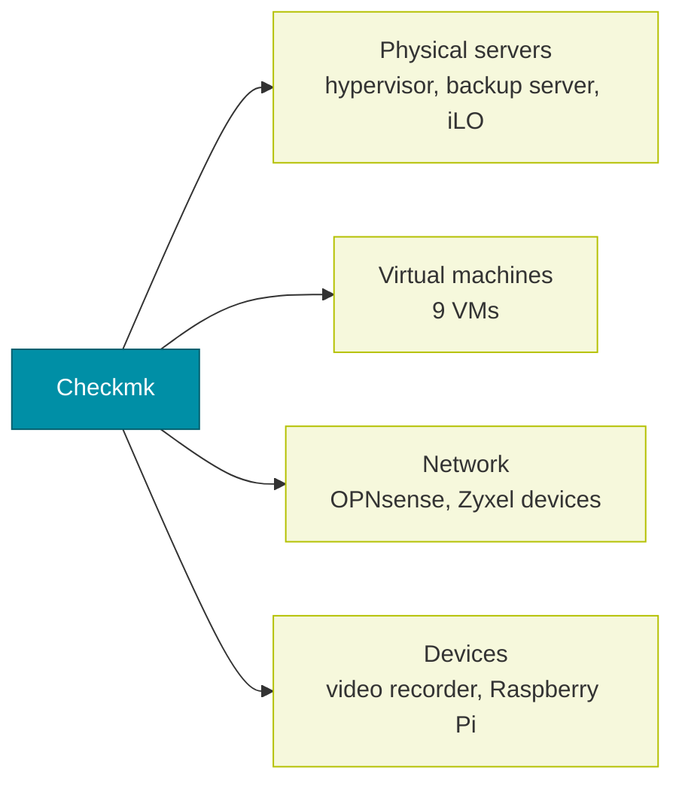

# Overview of my infrastructure

Configuration documentation of my personal infrastructure: network, firewall, reverse proxy, virtualization, backup, automation and monitoring. Addresses, domain names, credentials and serial numbers are deliberately left out.

# Network and firewall

The firewall is a physical **OPNsense** appliance. It routes the local network, isolates the guest network and spreads traffic across three Internet links. Only the parts specific to this setup are described here: interfaces, filter rules and NAT.

## Interfaces

| Interface | Port | Role | Addressing |
| --- | --- | --- | --- |
| LAN | igc0 | local network | static |
| Guests | VLAN 30 on igc0 | guest network | static |
| Fiber 1 | igc1 | Internet access | DHCP |
| Fiber 2 | igc2 | Internet access, default gateway | static, behind an ISP router |
| Starlink | igc3 | backup Internet access | DHCP |
| WireGuard | wg0 | remote access tunnel | — |

## Multiple Internet links

Outbound traffic from the LAN and the guest network goes through a gateway group:

| Tier | Gateways | Behavior |
| --- | --- | --- |
| 1 | Fiber 1 and Fiber 2 | load balancing (round-robin) |
| 2 | Starlink | used only if tier 1 goes down |

Failover is triggered by link loss, packet loss or latency. Established connections are killed when a gateway changes state, so they reconnect over a healthy link.

## Blocklists

An alias groups public lists of malicious addresses, updated automatically. It is blocked inbound on all three Internet links and outbound from the LAN.

| List | Content |
| --- | --- |
| Spamhaus DROP and EDROP | hijacked networks or networks controlled by spammers |
| DShield | most active attack sources |
| Zeus, Palevo | botnet command-and-control servers |
| SSLBL (abuse.ch) | servers using malicious certificates |
| Ransomware Tracker (abuse.ch) | ransomware infrastructure |
| blocklist.de | reported attack sources (SSH, mail, web) |
| Eulerian | advertising tracking network |
| Tor | Tor exit nodes |

## Filter rules

Rules are evaluated in order; the first match wins.

### Internet links (Fiber 1, Fiber 2, Starlink)

| Action | Protocol | Source | Destination | Purpose |
| --- | --- | --- | --- | --- |
| Block | any | blocklists | any | known malicious traffic |
| Allow | TCP 80, TCP/UDP 443 | any | reverse proxy | publishing the websites (Fiber 1 and Fiber 2) |
| Allow | UDP | any | firewall | WireGuard remote access (Fiber 1 and Fiber 2) |
| Allow | ICMP | monitoring host | WAN addresses | link availability checks |

All other inbound traffic is blocked (OPNsense default rule).

### LAN

| Action | Protocol | Source | Destination | Purpose |
| --- | --- | --- | --- | --- |
| Allow | TCP/UDP 6556 | LAN | firewall | Checkmk agent on the firewall |
| Allow | UDP 53 | LAN | firewall | DNS resolution by the firewall |
| Allow | UDP 53 | Veeam server | any | external DNS for the backup server |
| Block | any | devices without Internet | any | IoT devices kept off the Internet |
| Block | any | LAN | blocklists | no connection to a malicious address |
| Block | UDP 53 | LAN | any | any other DNS is forbidden |
| Allow | ICMP | LAN | firewall, Internet | ping |
| Allow | any | monitoring host | firewall | firewall monitoring |
| Allow | any | LAN | any | Internet access through the multi-WAN group |
| Allow | any | cameras, IoT devices | any | outbound through the multi-WAN group |
| Allow | any | reverse proxy | any | outbound through Fiber 2 |

DNS is therefore enforced: every LAN device resolves through the firewall, which applies its own filtering.

### Guest network

| Action | Protocol | Source | Destination | Purpose |
| --- | --- | --- | --- | --- |
| Block | any | guests | LAN | full isolation from the local network |
| Allow | UDP 53 | guests | firewall | DNS through the firewall |
| Block | UDP 53 | guests | any | no other DNS |
| Allow | any | guests | any | Internet through the multi-WAN group |

### WireGuard

A WireGuard server accepts roaming clients. Traffic coming from the tunnel is fully allowed: a connected client reaches the LAN as if it were plugged in locally. The tunnel uses its own subnet, and the firewall provides DNS to the clients.

## NAT

| Type | Configuration |
| --- | --- |
| Port forwards | none active: the 4 HTTP/HTTPS forwards to the reverse proxy are disabled; inbound traffic already arrives addressed to the reverse proxy (translation most likely done upstream by the ISP routers) |
| Outbound NAT | hybrid mode: automatic OPNsense rules, plus the manual rules below |
| 1:1 NAT, NPTv6 | none |

| Manual outbound NAT | Interface | Effect |
| --- | --- | --- |
| Firewall local traffic | Fiber 2 | translated to the interface address |
| WireGuard clients | Fiber 2 | Internet access for roaming clients |

# NGINX reverse proxy

Every published service goes through a single entry point: a **FreeBSD** virtual machine running **NGINX** (nginx-full package). No internal service is exposed directly to the Internet.

## How it works

Every incoming request goes through the same steps:

- **Site selection**: one file per site in `sites-enabled/`; NGINX picks the `server` block from the requested name (`server_name`).
- **TLS**: TLS 1.2 and 1.3 only, AES-256-GCM encryption for TLS 1.2, hybrid post-quantum key exchange (`X25519MLKEM768`) with classic fallback, session tickets disabled, 0-RTT enabled. Let’s Encrypt certificates, one per domain.
- **Per-IP limits**: one connection zone per site (500 or 800 concurrent connections per IP), so a busy service does not eat into the others’ quota; a global cap of 2,000 requests per second against floods; a strict zone of 60 requests per minute (burst 20) on login pages, against credential stuffing.
- **NAXSI web application firewall**: the core rules are loaded globally but stay inactive; each site enables them (`SecRulesEnabled`) on selected locations, with blocking thresholds and an application-specific whitelist. A blocked request gets a shared error page served by the proxy itself, never by the application.
- **Security headers**: headers sent by the applications are first stripped (`proxy_hide_header`), then replaced by a single set (`more_set_headers`): HSTS with preload, Content-Security-Policy (WebSocket allowed), X-Frame-Options, X-Content-Type-Options, Referrer-Policy, Permissions-Policy, origin isolation. The NGINX version is hidden.
- **Forwarding**: `proxy_pass` to the service’s virtual machine, over HTTP or HTTPS depending on the application, with the `X-Real-IP`, `X-Forwarded-For` and `X-Forwarded-Proto` headers; WebSockets are relayed for real-time applications.

## Published services

| Service | Application | Machine | NAXSI protection | Notes |
| --- | --- | --- | --- | --- |
| Blog | WordPress | Webhost | whole site | sensitive files denied, `wp-login.php` and `xmlrpc.php` rate-limited |
| Website | Not documented | Webhost | whole site | — |
| Files | Nextcloud | Webhost | whole site except WebDAV | 800 connections per IP for sync |
| Wiki | Wiki.js | Webhost | whole site except GraphQL | — |
| Web analytics | Umami | Webhost | whole site | — |
| Git forge | Gitea | Webhost | whole site except API | Git protocol restricted to the LAN, dedicated rate limit |
| Git mirror | Not documented | Webhost | login | — |
| Home automation | Home Assistant | Home Assistant | authentication | WebSocket relayed |
| Media | Jellyfin | Media | authentication | 800 connections per IP for playback |
| Passwords | Passbolt | Passbolt | login and verification | HTTPS backend |
| Monitoring | Checkmk | Checkmk | login and two-factor authentication | — |
| Dashboards | Grafana | Raspberry Pi | login | — |

## Logs and CrowdSec

- Separate error logs and NAXSI logs per site.
- Access logs written per site **only for CrowdSec**. They are emptied every hour with no archive (`newsyslog`), so no browsing history is kept.
- CrowdSec analyzes these logs and bans malicious addresses through the virtual machine’s PF firewall.

## General settings

| Setting | Value |
| --- | --- |
| System | FreeBSD, `kqueue` event handling |
| File I/O | thread pool (`aio threads`) |
| Modules | headers-more, NAXSI; ndk and Lua loaded in preparation for an NGINX-side CrowdSec bouncer |

# Hyper-V virtualization

The services run on a single **Hyper-V** host. A second host, the backup server, only holds the Veeam replicas. Virtual machines are numbered (110 to 118) so they are easy to find in the console and in the backups.

## Host

| Item | Value |
| --- | --- |
| Hardware | Supermicro Super Server |
| Processor | Intel Xeon D-1518, 4 cores / 8 threads |
| Memory | 64 GB |
| System | Windows Server 2025 Datacenter, workgroup (not domain-joined) |
| Network | one 10 GbE link (Intel X552) carrying an external virtual switch, shared with the host |
| Storage | 931 GB system volume (system and virtual machines), 13,039 GB data volume |

## Backup server

| Item | Value |
| --- | --- |
| Hardware | HP ProLiant MicroServer Gen8 |
| Processor | Intel Xeon E3-1220L v2, 2 cores / 4 threads |
| Memory | 16 GB |
| System | Windows Server 2025 Datacenter, workgroup (not domain-joined) |
| Network | one 2.5 GbE link (Realtek) carrying an external virtual switch, shared with the host |
| Storage | two RAID volumes: 466 GB (system and replicas) and 14,902 GB (Veeam repository and replicas) |

It holds the 7 replicas created by Veeam (110-Webhost, 111-HAOS, 112-Reverse, 114-Paperless, 115-CheckMK, 116-Wazuh, 118-Passbolt, with a `_replica` suffix). They stay powered off, do not start with the host and are only used for failover. Each one has 4 vCPUs and the same memory as the original machine.

## Virtual machines

All machines are generation 2, with static memory, and start automatically with the host.

| Machine | System | vCPU | Memory | Disk | Role |
| --- | --- | --- | --- | --- | --- |
| 110-Webhost | Debian | 6 | 8 GB | 350 GB (fixed) | websites and web applications: NGINX, PHP 8.4, MariaDB, Docker |
| 111-HAOS | Home Assistant OS | 4 | 4 GB | 32 GB | home automation |
| 112-Reverse | FreeBSD | 4 | 4 GB | 20 GB (dynamic) | NGINX reverse proxy, CrowdSec |
| 113-Ansible | Debian | 4 | 1 GB | 40 GB (dynamic) | Ansible and Semaphore |
| 114-Paperless | Debian | 4 | 2 GB | 40 GB (dynamic) | Paperless document management |
| 115-CheckMK | Debian | 6 | 8 GB | 50 GB (fixed) | Checkmk monitoring |
| 116-Wazuh | Ubuntu | 6 | 6 GB | 100 GB (dynamic) | Wazuh SIEM |
| 117-Media | Debian | 6 | 12 GB | 8 TB (dynamic, data volume) | Jellyfin media library |
| 118-Passbolt | Debian | 4 | 2 GB | 30 GB (fixed) | Passbolt password manager |

In total, 44 vCPUs and 47 GB of memory are allocated on 8 threads and 64 GB.

# Veeam backup

Backups are handled by **Veeam Backup & Replication 13** (Enterprise Plus edition), installed on a dedicated physical server. This server is also a Hyper-V host managed by Veeam, which holds the replicas.

## Repositories

| Repository | Type | Notes |
| --- | --- | --- |
| Internal | 14,902 GB RAID volume on the backup server | main repository |
| USB disks in rotation | removable local disk | disks swapped in turn |
| Backblaze B2 | S3-compatible object storage | 7-day immutability, capped at 2 TB |

## Jobs

| Job | Type | Content | Trigger | Retention | Encryption |
| --- | --- | --- | --- | --- | --- |
| Prod - Internal | VM backup | all hypervisor VMs except Media | daily at 21:00 | 31 days | yes |
| Media - Internal | VM backup | Media | after Prod - Internal | 7 days | no |
| Backup Hypervisor OS | Windows agent | selected files of the hypervisor system | daily at 21:00 | 7 days | no |
| Prod - BackBlaze B2 | backup copy | Prod - Internal restore points | as soon as a point is created | 21 days | yes |
| Prod - External | backup copy | Prod - Internal restore points | as soon as a point is created | 31 days | yes |
| Prod - Replicate Critical VMs | replication | Webhost, Home Assistant, Reverse, Paperless, Checkmk, Wazuh, Passbolt | after Prod - Internal | 1 point | — |
| Backup Configuration Job | Veeam configuration | configuration database, to the USB disks | scheduled at 01:30 | 10 points | Not documented |

The Media VM, the largest one, is backed up separately with short retention; it is neither copied to B2 or USB nor replicated.

# Automation: Ansible and Semaphore

Updates and maintenance tasks are written as **Ansible** playbooks and run by **Semaphore** (web interface and scheduler), on the Ansible virtual machine.

## Semaphore configuration

| Item | Configuration |
| --- | --- |
| Playbook repository | local folder on the Ansible machine |
| Inventories | static, one per group of machines |
| Linux / FreeBSD connection | SSH with ED25519 key |
| Windows connection | WinRM over HTTPS; credentials kept in Semaphore’s key store |
| Alerts | enabled for failed tasks |

## Schedule

On weekends, a snapshot of each VM is taken before the updates so they can be rolled back; the snapshots are removed on Sunday evening. Windows servers are updated during the week, on different days.

| Day | Time | Task | Target |
| --- | --- | --- | --- |
| Wednesday, Thursday | 01:00 | Windows updates | backup server |
| Thursday, Friday | 04:00 | Windows updates | hypervisor |
| Saturday, Sunday | 05:15 | snapshot of all VMs | hypervisor |
| Saturday, Sunday | 05:30 | Debian / Ubuntu updates | Linux VMs and Raspberry Pi |
| Saturday, Sunday | 05:30 | FreeBSD updates | reverse proxy |
| Saturday, Sunday | 07:00 | Nextcloud update | Webhost |
| Sunday | 21:00 | snapshot removal | hypervisor |

## On-demand tasks

| Task | Target | Action |
| --- | --- | --- |
| Wazuh index cleanup | Wazuh | cleanup script, then restart of the manager, the indexer and the dashboard |
| Wazuh agent update | Wazuh | updates every agent reported as outdated |

## What the playbooks do

- **Windows** (backup server, hypervisor): reboot first if a reboot is pending, install critical and security updates, then reboot if needed.
- **Debian / Ubuntu**: `apt update` then `dist-upgrade` keeping local configuration files; `needrestart` restarts the affected services, or the whole machine if the kernel changed.
- **FreeBSD**: `freebsd-update fetch` and `install`, `pkg upgrade`, package cache cleanup, reboot if the base system changed.
- **Snapshots**: `Checkpoint-VM` on every VM before the updates, `Remove-VMSnapshot` on Sunday evening.
- **Nextcloud**: runs the official updater in non-interactive mode, as the application user.
- **Semaphore** updates itself through a dedicated playbook (log emptied, package upgraded, service restarted).

# Checkmk monitoring

Monitoring is handled by **Checkmk** (single site), on a dedicated virtual machine. It covers the servers, the virtual machines, the network and a few devices.

## Monitored hosts

| Group | Host | Services |
| --- | --- | --- |
| Physical servers | Hyper-V hypervisor | 27 |
| Physical servers | backup server | 12 |
| Physical servers | backup server iLO management card | 24 |
| Virtual machines | Webhost | 32 |
| Virtual machines | Media | 30 |
| Virtual machines | Paperless | 27 |
| Virtual machines | Checkmk | 25 |
| Virtual machines | Reverse | 25 |
| Virtual machines | Passbolt | 20 |
| Virtual machines | Wazuh | 19 |
| Virtual machines | Ansible | 14 |
| Virtual machines | Home Assistant | 8 |
| Network | OPNsense firewall | 27 |
| Network | Zyxel XGS switch (house) | 1 |
| Network | Zyxel XGS switch (garage) | 1 |
| Network | Zyxel BE5100 device | 1 |
| Devices | Raspberry Pi (electricity meter teleinfo) | 20 |
| Devices | video recorder | 4 |

## Sample checks (Webhost)

- HTTPS availability and HTTP version of the published sites, through the reverse proxy.
- Key systemd services: Docker, MariaDB, NGINX, PHP-FPM, plus a summary of failed services and sockets.
- Resources: memory, thread count, kernel performance, TCP connections.
- System: NTP synchronization, mount options, uptime.
