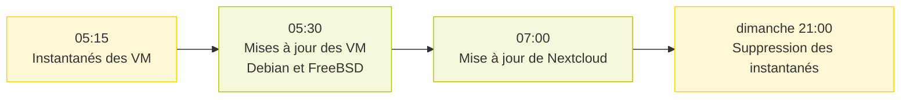

# Automatisation : Ansible et Semaphore
Les mises à jour et les tâches d’entretien sont écrites en playbooks **Ansible** et lancées par **Semaphore** (interface web et planificateur), sur la machine virtuelle Ansible.

# Configuration de Semaphore

| Élément | Configuration |
| --- | --- |
| Dépôt des playbooks | dossier local de la machine Ansible |
| Inventaires | statiques, un par groupe de machines |
| Connexion Linux / FreeBSD | SSH par clé ED25519 |
| Connexion Windows | WinRM en HTTPS ; identifiants conservés dans le magasin de clés de Semaphore |
| Alertes | activées pour les échecs de tâches |

# Planning

Le week-end, un instantané de chaque VM est pris avant les mises à jour, pour pouvoir revenir en arrière ; les instantanés sont supprimés le dimanche soir. Les serveurs Windows sont mis à jour en semaine, à des jours différents.

| Jour | Heure | Tâche | Cible |
| --- | --- | --- | --- |
| mercredi, jeudi | 01:00 | mises à jour Windows | serveur de sauvegarde |
| jeudi, vendredi | 04:00 | mises à jour Windows | hyperviseur |
| samedi, dimanche | 05:15 | instantané de toutes les VM | hyperviseur |
| samedi, dimanche | 05:30 | mises à jour Debian / Ubuntu | VM Linux et Raspberry Pi |
| samedi, dimanche | 05:30 | mises à jour FreeBSD | reverse proxy |
| samedi, dimanche | 07:00 | mise à jour de Nextcloud | Webhost |
| dimanche | 21:00 | suppression des instantanés | hyperviseur |

# Tâches à la demande

| Tâche | Cible | Action |
| --- | --- | --- |
| Nettoyage de l’index Wazuh | Wazuh | script de nettoyage, puis redémarrage du manager, de l’indexeur et du tableau de bord |
| Mise à jour des agents Wazuh | Wazuh | met à jour chaque agent signalé comme obsolète |

# Ce que font les playbooks

- **Windows** (serveur de sauvegarde, hyperviseur) : redémarrage préalable si un redémarrage est en attente, installation des mises à jour critiques et de sécurité, puis redémarrage si nécessaire.
- **Debian / Ubuntu** : `apt update` puis `dist-upgrade` en conservant les fichiers de configuration locaux ; `needrestart` redémarre les services concernés ou toute la machine si le noyau a changé.
- **FreeBSD** : `freebsd-update fetch` et `install`, `pkg upgrade`, nettoyage du cache des paquets, redémarrage si le système de base a changé.
- **Instantanés** : `Checkpoint-VM` sur toutes les VM avant les mises à jour, `Remove-VMSnapshot` le dimanche soir.
- **Nextcloud** : lancement de l’updater officiel en mode non interactif, sous l’utilisateur de l’application.
- **Semaphore** se met lui-même à jour par un playbook dédié (journal vidé, paquet mis à jour, service redémarré).
