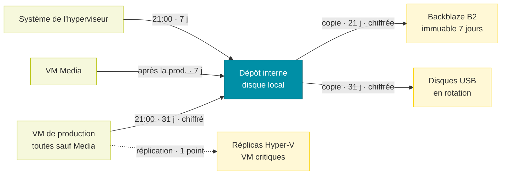

# Sauvegarde Veeam

Les sauvegardes sont gérées par **Veeam Backup & Replication 13** (édition Enterprise Plus), installé sur un serveur physique dédié. Ce serveur est aussi un hôte Hyper-V géré par Veeam, vraisemblablement destinataire des réplicas.

# Dépôts

| Dépôt | Type | Particularités |
| --- | --- | --- |
| Interne | disque local du serveur de sauvegarde | dépôt principal |
| Disques USB en rotation | disque local amovible | disques échangés à tour de rôle |
| Backblaze B2 | stockage objet compatible S3 | immuabilité 7 jours, limité à 2 To |

# Tâches

| Tâche | Type | Contenu | Déclenchement | Rétention | Chiffrement |
| --- | --- | --- | --- | --- | --- |
| Prod - Internal | sauvegarde de VM | toutes les VM de l’hyperviseur sauf Media | chaque jour à 21:00 | 31 jours | oui |
| Media - Internal | sauvegarde de VM | Media | après Prod - Internal | 7 jours | non |
| Backup Hypervisor OS | agent Windows | fichiers sélectionnés du système de l’hyperviseur | chaque jour à 21:00 | 7 jours | non |
| Prod - BackBlaze B2 | copie de sauvegarde | points de Prod - Internal | dès qu’un point est créé | 21 jours | oui |
| Prod - External | copie de sauvegarde | points de Prod - Internal | dès qu’un point est créé | 31 jours | oui |
| Prod - Replicate Critical VMs | réplication | Webhost, Home Assistant, Reverse, Paperless, Checkmk, Wazuh, Passbolt | après Prod - Internal | 1 point | — |
| Backup Configuration Job | configuration Veeam | base de configuration, vers les disques USB | planifiée à 01:30 | 10 points | Non documenté |

La VM Media, la plus volumineuse, est sauvegardée à part avec une rétention courte ; elle n’est ni copiée sur B2 ou USB ni répliquée.
