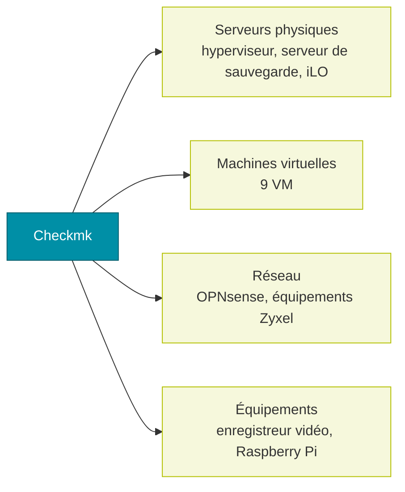

# Supervision Checkmk
La supervision est assurée par **Checkmk** (site unique), sur une machine virtuelle dédiée. Elle couvre les serveurs, les machines virtuelles, le réseau et quelques équipements.

# Hôtes supervisés

| Groupe | Hôte | Services |
| --- | --- | --- |
| Serveurs physiques | hyperviseur Hyper-V | 27 |
| Serveurs physiques | serveur de sauvegarde | 12 |
| Serveurs physiques | carte de gestion iLO du serveur de sauvegarde | 24 |
| Machines virtuelles | Webhost | 32 |
| Machines virtuelles | Media | 30 |
| Machines virtuelles | Paperless | 27 |
| Machines virtuelles | Checkmk | 25 |
| Machines virtuelles | Reverse | 25 |
| Machines virtuelles | Passbolt | 20 |
| Machines virtuelles | Wazuh | 19 |
| Machines virtuelles | Ansible | 14 |
| Machines virtuelles | Home Assistant | 8 |
| Réseau | pare-feu OPNsense | 27 |
| Réseau | commutateur Zyxel XGS (maison) | 1 |
| Réseau | commutateur Zyxel XGS (garage) | 1 |
| Réseau | équipement Zyxel BE5100 | 1 |
| Équipements | Raspberry Pi (téléinfo du compteur électrique) | 20 |
| Équipements | enregistreur vidéo | 4 |

# Exemple de contrôles (Webhost)

- Disponibilité HTTPS et version HTTP des sites publiés, à travers le reverse proxy.
- Services systemd essentiels : Docker, MariaDB, NGINX, PHP-FPM, plus un récapitulatif des services et sockets en échec.
- Ressources : mémoire, nombre de threads, performances du noyau, connexions TCP.
- Système : synchronisation NTP, options de montage, durée de fonctionnement.