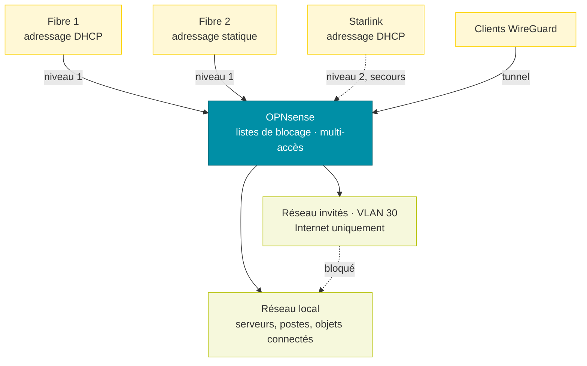

# Réseau et pare-feu

Le pare-feu est un **OPNsense** physique. Il route le réseau local, isole le réseau invités et répartit le trafic sur trois accès Internet. Seules les parties propres à cette installation sont décrites ici : interfaces, règles de filtrage et NAT.

# Interfaces

| Interface | Port | Rôle | Adressage |
| --- | --- | --- | --- |
| LAN | igc0 | réseau local | statique |
| Invités | VLAN 30 sur igc0 | réseau invités | statique |
| Fibre 1 | igc1 | accès Internet | DHCP |
| Fibre 2 | igc2 | accès Internet, passerelle par défaut | statique, derrière un routeur opérateur |
| Starlink | igc3 | accès Internet de secours | DHCP |
| WireGuard | wg0 | tunnel d’accès distant | — |

# Accès Internet multiples

Le trafic sortant du LAN et des invités passe par un groupe de passerelles :

| Niveau | Passerelles | Fonctionnement |
| --- | --- | --- |
| 1 | Fibre 1 et Fibre 2 | répartition de charge (round-robin) |
| 2 | Starlink | utilisé seulement si le niveau 1 tombe |

La bascule se déclenche sur coupure, perte de paquets ou latence. Les connexions établies sont coupées lorsqu’une passerelle change d’état, pour qu’elles se rétablissent par un lien sain.

# Listes de blocage

Un alias regroupe des listes publiques d’adresses malveillantes, mises à jour automatiquement. Il est bloqué en entrée sur les trois accès Internet et en sortie depuis le LAN.

| Liste | Contenu |
| --- | --- |
| Spamhaus DROP et EDROP | réseaux détournés ou contrôlés par des spammeurs |
| DShield | sources d’attaques les plus actives |
| Zeus, Palevo | serveurs de commande de botnets |
| SSLBL (abuse.ch) | serveurs utilisant des certificats malveillants |
| Ransomware Tracker (abuse.ch) | infrastructures de rançongiciels |
| blocklist.de | sources d’attaques signalées (SSH, mail, web) |
| Eulerian | réseau de pistage publicitaire |
| Tor | nœuds de sortie Tor |

# Règles de filtrage

Les règles s’appliquent dans l’ordre, la première qui correspond l’emporte.

## Accès Internet (Fibre 1, Fibre 2, Starlink)

| Action | Protocole | Source | Destination | Objet |
| --- | --- | --- | --- | --- |
| Bloquer | tous | listes de blocage | tout | trafic malveillant connu |
| Autoriser | TCP 80, TCP/UDP 443 | tout | reverse proxy | publication des sites (Fibre 1 et Fibre 2) |
| Autoriser | UDP | tout | pare-feu | accès distant WireGuard (Fibre 1 et Fibre 2) |
| Autoriser | ICMP | hôte de supervision | adresses WAN | contrôle de disponibilité des liens |

Tout autre trafic entrant est bloqué (règle par défaut d’OPNsense).

## LAN

| Action | Protocole | Source | Destination | Objet |
| --- | --- | --- | --- | --- |
| Autoriser | TCP/UDP 6556 | LAN | pare-feu | agent Checkmk du pare-feu |
| Autoriser | UDP 53 | LAN | pare-feu | résolution DNS par le pare-feu |
| Autoriser | UDP 53 | serveur Veeam | tout | DNS externe pour le serveur de sauvegarde |
| Bloquer | tous | appareils sans Internet | tout | objets connectés privés d’Internet |
| Bloquer | tous | LAN | listes de blocage | aucune connexion vers une adresse malveillante |
| Bloquer | UDP 53 | LAN | tout | tout autre DNS est interdit |
| Autoriser | ICMP | LAN | pare-feu, Internet | ping |
| Autoriser | tous | hôte de supervision | pare-feu | supervision du pare-feu |
| Autoriser | tous | LAN | tout | sortie Internet par le groupe multi-accès |
| Autoriser | tous | caméras, objets connectés | tout | sortie par le groupe multi-accès |
| Autoriser | tous | reverse proxy | tout | sortie par la Fibre 2 |

Le DNS est donc imposé : chaque appareil du LAN résout par le pare-feu, qui applique son propre filtrage.

## Réseau invités

| Action | Protocole | Source | Destination | Objet |
| --- | --- | --- | --- | --- |
| Bloquer | tous | invités | LAN | isolement complet du réseau local |
| Autoriser | UDP 53 | invités | pare-feu | DNS par le pare-feu |
| Bloquer | UDP 53 | invités | tout | pas d’autre DNS |
| Autoriser | tous | invités | tout | Internet par le groupe multi-accès |

## WireGuard

Un serveur WireGuard accueille les clients nomades. Le trafic venant du tunnel est entièrement autorisé : un client connecté accède au LAN comme s’il y était branché. Le tunnel utilise son propre sous-réseau, et le pare-feu fournit le DNS aux clients.

# NAT

| Type | Configuration |
| --- | --- |
| Redirections de port | aucune active : les 4 redirections HTTP/HTTPS vers le reverse proxy sont désactivées, les flux entrants arrivent déjà adressés au reverse proxy (translation vraisemblablement faite en amont par les box opérateur) |
| NAT sortant | mode hybride : règles automatiques d’OPNsense, plus les règles manuelles ci-dessous |
| NAT 1:1, NPTv6 | aucun |

| NAT sortant manuel | Interface | Effet |
| --- | --- | --- |
| Trafic local du pare-feu | Fibre 2 | traduit vers l’adresse de l’interface |
| Clients WireGuard | Fibre 2 | sortie Internet des clients nomades |
