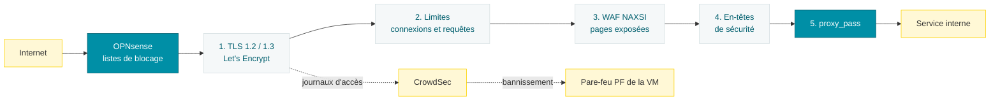

# Reverse proxy NGINX
Tous les services publiés passent par un seul point d’entrée : une machine virtuelle **FreeBSD** qui exécute **NGINX** (paquet nginx-full). Aucun service interne n’est exposé directement à Internet.

# Fonctionnement

Chaque requête entrante traverse les mêmes étapes :

- **Sélection du site** : un fichier par site dans `sites-enabled/` ; NGINX choisit le bloc `server` d’après le nom demandé (`server_name`).
- **TLS** : TLS 1.2 et 1.3 seulement, chiffrement AES-256-GCM en TLS 1.2, échange de clés hybride post-quantique (`X25519MLKEM768`) avec repli classique, tickets de session désactivés, 0-RTT activé. Certificats Let’s Encrypt, un par domaine.
- **Limites par adresse IP** : une zone de connexions par site (500 ou 800 connexions simultanées par IP), pour qu’un service chargé ne consomme pas le quota des autres ; un plafond global de 2 000 requêtes par seconde contre les inondations ; une zone stricte de 60 requêtes par minute (rafale 20) sur les pages de connexion, contre le bourrage d’identifiants.
- **Pare-feu applicatif NAXSI** : les règles de base sont chargées globalement mais restent inactives ; chaque site les active (`SecRulesEnabled`) sur les emplacements choisis, avec des seuils de blocage et une liste blanche propre à l’application. Une requête bloquée reçoit une page d’erreur commune servie par le proxy lui-même, jamais par l’application.
- **En-têtes de sécurité** : les en-têtes renvoyés par les applications sont d’abord supprimés (`proxy_hide_header`), puis remplacés par un jeu unique (`more_set_headers`) : HSTS avec preload, Content-Security-Policy (WebSocket autorisé), X-Frame-Options, X-Content-Type-Options, Referrer-Policy, Permissions-Policy, isolation d’origine. La version de NGINX est masquée.
- **Transmission** : `proxy_pass` vers la machine virtuelle du service, en HTTP ou HTTPS selon l’application, avec les en-têtes `X-Real-IP`, `X-Forwarded-For` et `X-Forwarded-Proto` ; les WebSockets sont relayés pour les applications temps réel.

# Services publiés

| Service | Application | Machine | Protection NAXSI | Particularités |
| --- | --- | --- | --- | --- |
| Blog | WordPress | Webhost | site entier | fichiers sensibles refusés, `wp-login.php` et `xmlrpc.php` limités |
| Site web | Non documenté | Webhost | site entier | — |
| Fichiers | Nextcloud | Webhost | site entier sauf WebDAV | 800 connexions par IP pour la synchronisation |
| Wiki | Wiki.js | Webhost | site entier sauf GraphQL | — |
| Statistiques web | Umami | Webhost | site entier | — |
| Forge Git | Gitea | Webhost | site entier sauf API | protocole Git réservé au LAN, limite de débit dédiée |
| Miroir Git | Non documenté | Webhost | connexion | — |
| Domotique | Home Assistant | Home Assistant | authentification | WebSocket relayé |
| Médias | Jellyfin | Media | authentification | 800 connexions par IP pour la lecture |
| Mots de passe | Passbolt | Passbolt | connexion et vérification | backend en HTTPS |
| Supervision | Checkmk | Checkmk | connexion et double authentification | — |
| Tableaux de bord | Grafana | Raspberry Pi | connexion | — |

# Journaux et CrowdSec

- Journaux d’erreurs et journaux NAXSI séparés par site.
- Journaux d’accès écrits par site **uniquement pour CrowdSec**. Ils sont vidés toutes les heures sans archive (`newsyslog`), donc aucun historique de navigation n’est conservé.
- CrowdSec analyse ces journaux et bannit les adresses malveillantes via le pare-feu PF de la machine virtuelle.

# Réglages généraux

| Réglage | Valeur |
| --- | --- |
| Système | FreeBSD, gestion d’événements `kqueue` |
| Entrées-sorties fichiers | pool de threads (`aio threads`) |
| Modules | headers-more, NAXSI ; ndk et Lua chargés en prévision d’un bouncer CrowdSec côté NGINX |
