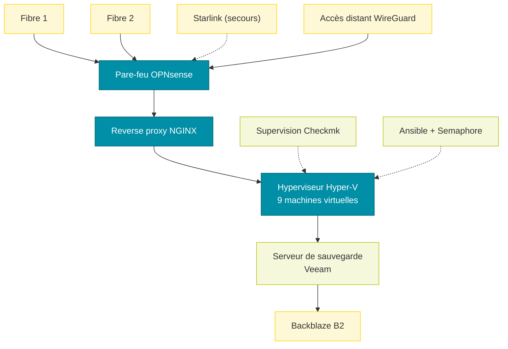

# Sommaire de mon infrastructure
Documentation de la configuration de mon infrastructure personnelle : réseau, pare-feu, reverse proxy, virtualisation, sauvegarde, automatisation et supervision. Les adresses, noms de domaine, identifiants et numéros de série sont volontairement omis.

- [Réseau et pare-feu](/fr/infra/infrastructure-network)
- [Reverse proxy NGINX](/fr/infra/infrastructure-reverse-proxy)
- [Virtualisation Hyper-V](/fr/infra/infrastructure-virtualization)
- [Sauvegarde Veeam](/fr/infra/infrastructure-backup)
- [Automatisation : Ansible et Semaphore](/fr/infra/infrastructure-automation)
- [Supervision Checkmk](/fr/infra/infrastructure-monitoring)
