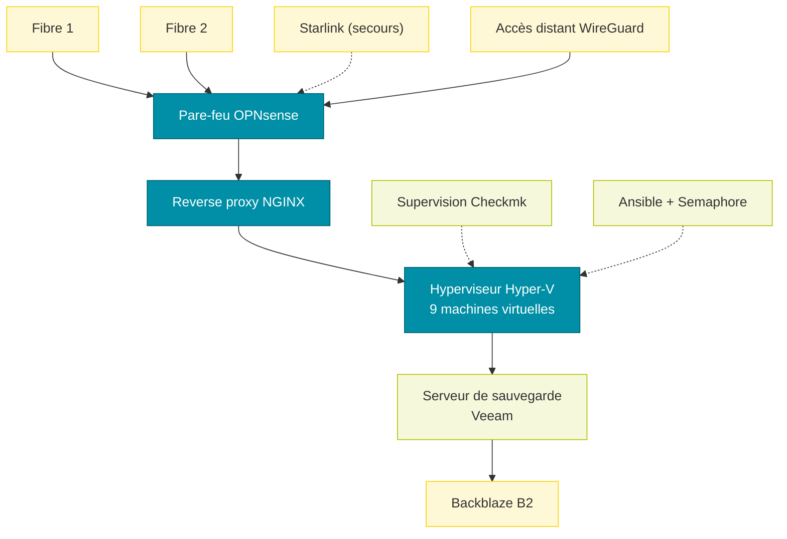
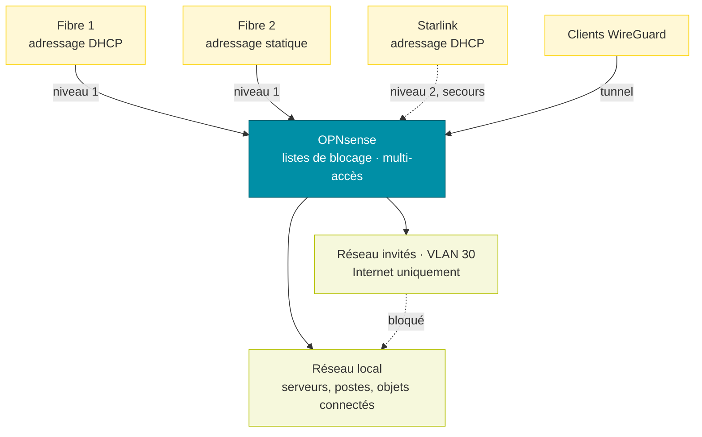
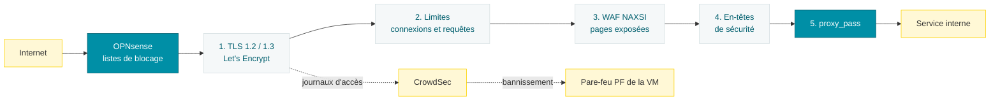
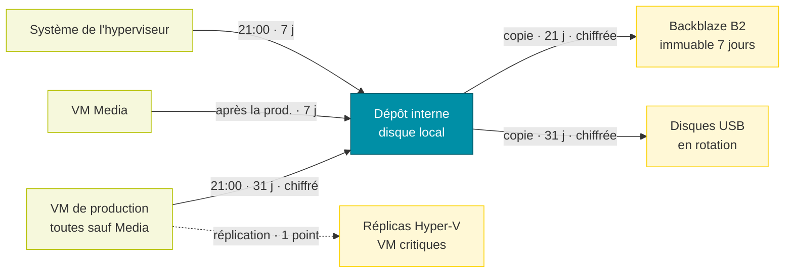
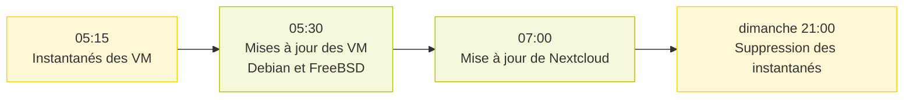
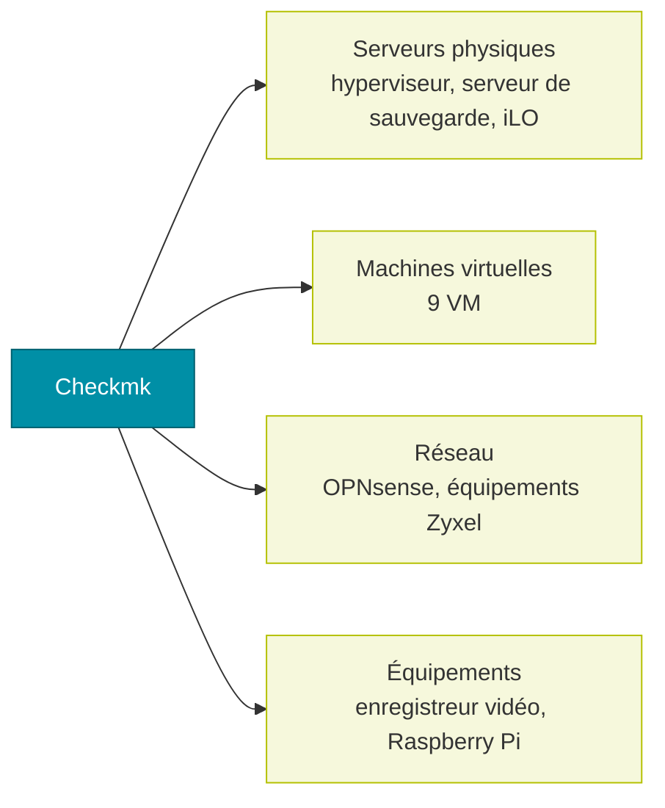

# Descriptif de mon infrastructure

Documentation de la configuration de mon infrastructure personnelle : réseau, pare-feu, reverse proxy, virtualisation, sauvegarde, automatisation et supervision. Les adresses, noms de domaine, identifiants et numéros de série sont volontairement omis.

# Réseau et pare-feu

Le pare-feu est un **OPNsense** physique. Il route le réseau local, isole le réseau invités et répartit le trafic sur trois accès Internet. Seules les parties propres à cette installation sont décrites ici : interfaces, règles de filtrage et NAT.

## Interfaces

| Interface | Port | Rôle | Adressage |
| --- | --- | --- | --- |
| LAN | igc0 | réseau local | statique |
| Invités | VLAN 30 sur igc0 | réseau invités | statique |
| Fibre 1 | igc1 | accès Internet | DHCP |
| Fibre 2 | igc2 | accès Internet, passerelle par défaut | statique, derrière un routeur opérateur |
| Starlink | igc3 | accès Internet de secours | DHCP |
| WireGuard | wg0 | tunnel d’accès distant | — |

## Accès Internet multiples

Le trafic sortant du LAN et des invités passe par un groupe de passerelles :

| Niveau | Passerelles | Fonctionnement |
| --- | --- | --- |
| 1 | Fibre 1 et Fibre 2 | répartition de charge (round-robin) |
| 2 | Starlink | utilisé seulement si le niveau 1 tombe |

La bascule se déclenche sur coupure, perte de paquets ou latence. Les connexions établies sont coupées lorsqu’une passerelle change d’état, pour qu’elles se rétablissent par un lien sain.

## Listes de blocage

Un alias regroupe des listes publiques d’adresses malveillantes, mises à jour automatiquement. Il est bloqué en entrée sur les trois accès Internet et en sortie depuis le LAN.

| Liste | Contenu |
| --- | --- |
| Spamhaus DROP et EDROP | réseaux détournés ou contrôlés par des spammeurs |
| DShield | sources d’attaques les plus actives |
| Zeus, Palevo | serveurs de commande de botnets |
| SSLBL (abuse.ch) | serveurs utilisant des certificats malveillants |
| Ransomware Tracker (abuse.ch) | infrastructures de rançongiciels |
| blocklist.de | sources d’attaques signalées (SSH, mail, web) |
| Eulerian | réseau de pistage publicitaire |
| Tor | nœuds de sortie Tor |

## Règles de filtrage

Les règles s’appliquent dans l’ordre, la première qui correspond l’emporte.

### Accès Internet (Fibre 1, Fibre 2, Starlink)

| Action | Protocole | Source | Destination | Objet |
| --- | --- | --- | --- | --- |
| Bloquer | tous | listes de blocage | tout | trafic malveillant connu |
| Autoriser | TCP 80, TCP/UDP 443 | tout | reverse proxy | publication des sites (Fibre 1 et Fibre 2) |
| Autoriser | UDP | tout | pare-feu | accès distant WireGuard (Fibre 1 et Fibre 2) |
| Autoriser | ICMP | hôte de supervision | adresses WAN | contrôle de disponibilité des liens |

Tout autre trafic entrant est bloqué (règle par défaut d’OPNsense).

### LAN

| Action | Protocole | Source | Destination | Objet |
| --- | --- | --- | --- | --- |
| Autoriser | TCP/UDP 6556 | LAN | pare-feu | agent Checkmk du pare-feu |
| Autoriser | UDP 53 | LAN | pare-feu | résolution DNS par le pare-feu |
| Autoriser | UDP 53 | serveur Veeam | tout | DNS externe pour le serveur de sauvegarde |
| Bloquer | tous | appareils sans Internet | tout | objets connectés privés d’Internet |
| Bloquer | tous | LAN | listes de blocage | aucune connexion vers une adresse malveillante |
| Bloquer | UDP 53 | LAN | tout | tout autre DNS est interdit |
| Autoriser | ICMP | LAN | pare-feu, Internet | ping |
| Autoriser | tous | hôte de supervision | pare-feu | supervision du pare-feu |
| Autoriser | tous | LAN | tout | sortie Internet par le groupe multi-accès |
| Autoriser | tous | caméras, objets connectés | tout | sortie par le groupe multi-accès |
| Autoriser | tous | reverse proxy | tout | sortie par la Fibre 2 |

Le DNS est donc imposé : chaque appareil du LAN résout par le pare-feu, qui applique son propre filtrage.

### Réseau invités

| Action | Protocole | Source | Destination | Objet |
| --- | --- | --- | --- | --- |
| Bloquer | tous | invités | LAN | isolement complet du réseau local |
| Autoriser | UDP 53 | invités | pare-feu | DNS par le pare-feu |
| Bloquer | UDP 53 | invités | tout | pas d’autre DNS |
| Autoriser | tous | invités | tout | Internet par le groupe multi-accès |

### WireGuard

Un serveur WireGuard accueille les clients nomades. Le trafic venant du tunnel est entièrement autorisé : un client connecté accède au LAN comme s’il y était branché. Le tunnel utilise son propre sous-réseau, et le pare-feu fournit le DNS aux clients.

## NAT

| Type | Configuration |
| --- | --- |
| Redirections de port | aucune active : les 4 redirections HTTP/HTTPS vers le reverse proxy sont désactivées, les flux entrants arrivent déjà adressés au reverse proxy (translation vraisemblablement faite en amont par les box opérateur) |
| NAT sortant | mode hybride : règles automatiques d’OPNsense, plus les règles manuelles ci-dessous |
| NAT 1:1, NPTv6 | aucun |

| NAT sortant manuel | Interface | Effet |
| --- | --- | --- |
| Trafic local du pare-feu | Fibre 2 | traduit vers l’adresse de l’interface |
| Clients WireGuard | Fibre 2 | sortie Internet des clients nomades |

# Reverse proxy NGINX

Tous les services publiés passent par un seul point d’entrée : une machine virtuelle **FreeBSD** qui exécute **NGINX** (paquet nginx-full). Aucun service interne n’est exposé directement à Internet.

## Fonctionnement

Chaque requête entrante traverse les mêmes étapes :

- **Sélection du site** : un fichier par site dans `sites-enabled/` ; NGINX choisit le bloc `server` d’après le nom demandé (`server_name`).
- **TLS** : TLS 1.2 et 1.3 seulement, chiffrement AES-256-GCM en TLS 1.2, échange de clés hybride post-quantique (`X25519MLKEM768`) avec repli classique, tickets de session désactivés, 0-RTT activé. Certificats Let’s Encrypt, un par domaine.
- **Limites par adresse IP** : une zone de connexions par site (500 ou 800 connexions simultanées par IP), pour qu’un service chargé ne consomme pas le quota des autres ; un plafond global de 2 000 requêtes par seconde contre les inondations ; une zone stricte de 60 requêtes par minute (rafale 20) sur les pages de connexion, contre le bourrage d’identifiants.
- **Pare-feu applicatif NAXSI** : les règles de base sont chargées globalement mais restent inactives ; chaque site les active (`SecRulesEnabled`) sur les emplacements choisis, avec des seuils de blocage et une liste blanche propre à l’application. Une requête bloquée reçoit une page d’erreur commune servie par le proxy lui-même, jamais par l’application.
- **En-têtes de sécurité** : les en-têtes renvoyés par les applications sont d’abord supprimés (`proxy_hide_header`), puis remplacés par un jeu unique (`more_set_headers`) : HSTS avec preload, Content-Security-Policy (WebSocket autorisé), X-Frame-Options, X-Content-Type-Options, Referrer-Policy, Permissions-Policy, isolation d’origine. La version de NGINX est masquée.
- **Transmission** : `proxy_pass` vers la machine virtuelle du service, en HTTP ou HTTPS selon l’application, avec les en-têtes `X-Real-IP`, `X-Forwarded-For` et `X-Forwarded-Proto` ; les WebSockets sont relayés pour les applications temps réel.

## Services publiés

| Service | Application | Machine | Protection NAXSI | Particularités |
| --- | --- | --- | --- | --- |
| Blog | WordPress | Webhost | site entier | fichiers sensibles refusés, `wp-login.php` et `xmlrpc.php` limités |
| Site web | Non documenté | Webhost | site entier | — |
| Fichiers | Nextcloud | Webhost | site entier sauf WebDAV | 800 connexions par IP pour la synchronisation |
| Wiki | Wiki.js | Webhost | site entier sauf GraphQL | — |
| Statistiques web | Umami | Webhost | site entier | — |
| Forge Git | Gitea | Webhost | site entier sauf API | protocole Git réservé au LAN, limite de débit dédiée |
| Miroir Git | Non documenté | Webhost | connexion | — |
| Domotique | Home Assistant | Home Assistant | authentification | WebSocket relayé |
| Médias | Jellyfin | Media | authentification | 800 connexions par IP pour la lecture |
| Mots de passe | Passbolt | Passbolt | connexion et vérification | backend en HTTPS |
| Supervision | Checkmk | Checkmk | connexion et double authentification | — |
| Tableaux de bord | Grafana | Raspberry Pi | connexion | — |

## Journaux et CrowdSec

- Journaux d’erreurs et journaux NAXSI séparés par site.
- Journaux d’accès écrits par site **uniquement pour CrowdSec**. Ils sont vidés toutes les heures sans archive (`newsyslog`), donc aucun historique de navigation n’est conservé.
- CrowdSec analyse ces journaux et bannit les adresses malveillantes via le pare-feu PF de la machine virtuelle.

## Réglages généraux

| Réglage | Valeur |
| --- | --- |
| Système | FreeBSD, gestion d’événements `kqueue` |
| Entrées-sorties fichiers | pool de threads (`aio threads`) |
| Modules | headers-more, NAXSI ; ndk et Lua chargés en prévision d’un bouncer CrowdSec côté NGINX |

# Virtualisation Hyper-V

Les services tournent sur un seul hôte **Hyper-V**. Les machines virtuelles sont numérotées (110 à 118) pour les retrouver facilement dans la console et dans les sauvegardes.

## Hôte

| Élément | Valeur |
| --- | --- |
| Matériel | Supermicro Super Server |
| Processeur | Intel Xeon D-1518, 4 cœurs / 8 threads |
| Mémoire | 64 Go |
| Système | Windows Server 2025 Datacenter, groupe de travail (hors domaine) |
| Réseau | un lien 10 GbE (Intel X552) portant un commutateur virtuel externe, partagé avec l’hôte |
| Stockage | volume système de 931 Go (système et machines virtuelles), volume de données de 13 039 Go |

## Machines virtuelles

Toutes les machines sont en génération 2, avec mémoire statique, et démarrent automatiquement avec l’hôte.

| Machine | Système | vCPU | Mémoire | Disque | Rôle |
| --- | --- | --- | --- | --- | --- |
| 110-Webhost | Debian | 6 | 8 Go | 350 Go (fixe) | sites et applications web : NGINX, PHP 8.4, MariaDB, Docker |
| 111-HAOS | Home Assistant OS | 4 | 4 Go | 32 Go | domotique |
| 112-Reverse | FreeBSD | 4 | 4 Go | 20 Go (dynamique) | reverse proxy NGINX, CrowdSec |
| 113-Ansible | Debian | 4 | 1 Go | 40 Go (dynamique) | Ansible et Semaphore |
| 114-Paperless | Debian | 4 | 2 Go | 40 Go (dynamique) | gestion documentaire Paperless |
| 115-CheckMK | Debian | 6 | 8 Go | 50 Go (fixe) | supervision Checkmk |
| 116-Wazuh | Ubuntu | 6 | 6 Go | 100 Go (dynamique) | SIEM Wazuh |
| 117-Media | Debian | 6 | 12 Go | 8 To (dynamique, volume de données) | médiathèque Jellyfin |
| 118-Passbolt | Debian | 4 | 2 Go | 30 Go (fixe) | gestionnaire de mots de passe Passbolt |

Au total, 44 vCPU et 47 Go de mémoire sont alloués sur 8 threads et 64 Go.

# Sauvegarde Veeam

Les sauvegardes sont gérées par **Veeam Backup & Replication 13** (édition Enterprise Plus), installé sur un serveur physique dédié. Ce serveur est aussi un hôte Hyper-V géré par Veeam, vraisemblablement destinataire des réplicas.

## Dépôts

| Dépôt | Type | Particularités |
| --- | --- | --- |
| Interne | disque local du serveur de sauvegarde | dépôt principal |
| Disques USB en rotation | disque local amovible | disques échangés à tour de rôle |
| Backblaze B2 | stockage objet compatible S3 | immuabilité 7 jours, limité à 2 To |

## Tâches

| Tâche | Type | Contenu | Déclenchement | Rétention | Chiffrement |
| --- | --- | --- | --- | --- | --- |
| Prod - Internal | sauvegarde de VM | toutes les VM de l’hyperviseur sauf Media | chaque jour à 21:00 | 31 jours | oui |
| Media - Internal | sauvegarde de VM | Media | après Prod - Internal | 7 jours | non |
| Backup Hypervisor OS | agent Windows | fichiers sélectionnés du système de l’hyperviseur | chaque jour à 21:00 | 7 jours | non |
| Prod - BackBlaze B2 | copie de sauvegarde | points de Prod - Internal | dès qu’un point est créé | 21 jours | oui |
| Prod - External | copie de sauvegarde | points de Prod - Internal | dès qu’un point est créé | 31 jours | oui |
| Prod - Replicate Critical VMs | réplication | Webhost, Home Assistant, Reverse, Paperless, Checkmk, Wazuh, Passbolt | après Prod - Internal | 1 point | — |
| Backup Configuration Job | configuration Veeam | base de configuration, vers les disques USB | planifiée à 01:30 | 10 points | Non documenté |

La VM Media, la plus volumineuse, est sauvegardée à part avec une rétention courte ; elle n’est ni copiée sur B2 ou USB ni répliquée.

# Automatisation : Ansible et Semaphore

Les mises à jour et les tâches d’entretien sont écrites en playbooks **Ansible** et lancées par **Semaphore** (interface web et planificateur), sur la machine virtuelle Ansible.

## Configuration de Semaphore

| Élément | Configuration |
| --- | --- |
| Dépôt des playbooks | dossier local de la machine Ansible |
| Inventaires | statiques, un par groupe de machines |
| Connexion Linux / FreeBSD | SSH par clé ED25519 |
| Connexion Windows | WinRM en HTTPS ; identifiants conservés dans le magasin de clés de Semaphore |
| Alertes | activées pour les échecs de tâches |

## Planning

Le week-end, un instantané de chaque VM est pris avant les mises à jour, pour pouvoir revenir en arrière ; les instantanés sont supprimés le dimanche soir. Les serveurs Windows sont mis à jour en semaine, à des jours différents.

| Jour | Heure | Tâche | Cible |
| --- | --- | --- | --- |
| mercredi, jeudi | 01:00 | mises à jour Windows | serveur de sauvegarde |
| jeudi, vendredi | 04:00 | mises à jour Windows | hyperviseur |
| samedi, dimanche | 05:15 | instantané de toutes les VM | hyperviseur |
| samedi, dimanche | 05:30 | mises à jour Debian / Ubuntu | VM Linux et Raspberry Pi |
| samedi, dimanche | 05:30 | mises à jour FreeBSD | reverse proxy |
| samedi, dimanche | 07:00 | mise à jour de Nextcloud | Webhost |
| dimanche | 21:00 | suppression des instantanés | hyperviseur |

## Tâches à la demande

| Tâche | Cible | Action |
| --- | --- | --- |
| Nettoyage de l’index Wazuh | Wazuh | script de nettoyage, puis redémarrage du manager, de l’indexeur et du tableau de bord |
| Mise à jour des agents Wazuh | Wazuh | met à jour chaque agent signalé comme obsolète |

## Ce que font les playbooks

- **Windows** (serveur de sauvegarde, hyperviseur) : redémarrage préalable si un redémarrage est en attente, installation des mises à jour critiques et de sécurité, puis redémarrage si nécessaire.
- **Debian / Ubuntu** : `apt update` puis `dist-upgrade` en conservant les fichiers de configuration locaux ; `needrestart` redémarre les services concernés ou toute la machine si le noyau a changé.
- **FreeBSD** : `freebsd-update fetch` et `install`, `pkg upgrade`, nettoyage du cache des paquets, redémarrage si le système de base a changé.
- **Instantanés** : `Checkpoint-VM` sur toutes les VM avant les mises à jour, `Remove-VMSnapshot` le dimanche soir.
- **Nextcloud** : lancement de l’updater officiel en mode non interactif, sous l’utilisateur de l’application.
- **Semaphore** se met lui-même à jour par un playbook dédié (journal vidé, paquet mis à jour, service redémarré).

# Supervision Checkmk

La supervision est assurée par **Checkmk** (site unique), sur une machine virtuelle dédiée. Elle couvre les serveurs, les machines virtuelles, le réseau et quelques équipements.

## Hôtes supervisés

| Groupe | Hôte | Services |
| --- | --- | --- |
| Serveurs physiques | hyperviseur Hyper-V | 27 |
| Serveurs physiques | serveur de sauvegarde | 12 |
| Serveurs physiques | carte de gestion iLO du serveur de sauvegarde | 24 |
| Machines virtuelles | Webhost | 32 |
| Machines virtuelles | Media | 30 |
| Machines virtuelles | Paperless | 27 |
| Machines virtuelles | Checkmk | 25 |
| Machines virtuelles | Reverse | 25 |
| Machines virtuelles | Passbolt | 20 |
| Machines virtuelles | Wazuh | 19 |
| Machines virtuelles | Ansible | 14 |
| Machines virtuelles | Home Assistant | 8 |
| Réseau | pare-feu OPNsense | 27 |
| Réseau | commutateur Zyxel XGS (maison) | 1 |
| Réseau | commutateur Zyxel XGS (garage) | 1 |
| Réseau | équipement Zyxel BE5100 | 1 |
| Équipements | Raspberry Pi (téléinfo du compteur électrique) | 20 |
| Équipements | enregistreur vidéo | 4 |

## Exemple de contrôles (Webhost)

- Disponibilité HTTPS et version HTTP des sites publiés, à travers le reverse proxy.
- Services systemd essentiels : Docker, MariaDB, NGINX, PHP-FPM, plus un récapitulatif des services et sockets en échec.
- Ressources : mémoire, nombre de threads, performances du noyau, connexions TCP.
- Système : synchronisation NTP, options de montage, durée de fonctionnement.
